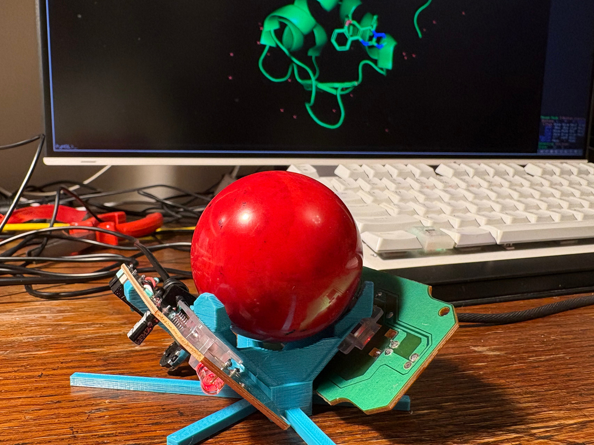

# trackball3D
Read billiard ball rotations in any 3D axis and control pymol camera accordingly.

Obviously, you also need to make the device :) Buy two mice and one billiard ball, 3D-print a piece of
plastic to keep it together and here you go!

If one day the model is ready, I will put it to [my Printables page](https://www.printables.com/@vaclavh_797838/models).

In the meantime, I think some pymol related tricks I used are worth publishing by themselves.
